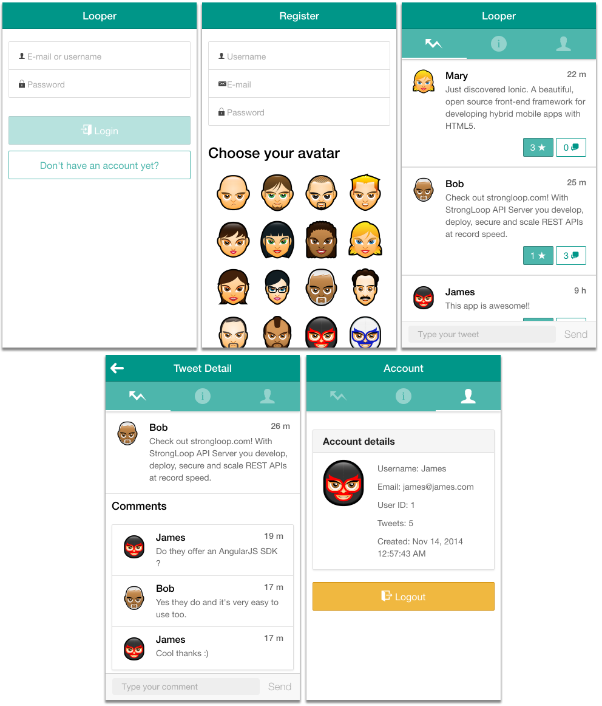

# Loopback Example: ionic
This example application demonstates how to use [LoopBack](http://loopback.io) with the [Ionic Framework](http://ionicframework.com/)
##Features
Looper is a basic microblogging clone with following features:
- Users can register and login to the app
- Only authorized user can see content
- Post, like and comment tweets
- User can choose an avatar


###Screenshots


##Prerequisites
Before starting, makes sure you've followed [Getting Started with LoopBack](http://docs.strongloop.com/display/LB/Getting+started+with+LoopBack) to install Node and LoopBack.
In adittion, you will need a basic understanding of:
 - [AngularJs](https://angularjs.org/)
 - Ionic [CSS](http://ionicframework.com/docs/components/) and [Javascript](http://ionicframework.com/docs/api/) components  

### Getting started
```
git clone https://github.com/belibasakis/loopback-example-ionic
cd loopback-example-ionic
npm install 
slc run
```
Open a new terminal
```
cd loopback-example-ionic/client
npm install
ionic serve
```
Open [localhost:8100](http://localhost:8100/) in your browser to view the app or get the (PhoneGap Developer App)[http://app.phonegap.com/] to run the app on your phone.

##ToDo
- Implement Passport.Js for FacebookAuth
- Optimize performence (less requests to server)
- Add feature like edit, delete...

##Usefull commands
- `lb-ng server/server.js client/www/lib/lb-services.js`to generate Loopback Service for AngularJS based on your project
- `lb-ng-doc client/www/lib/lb-services.js` show documentation for generated file

###Loopback Database Schema
- `avatar`
  - id number 
  - url string
  - ownerId number
- `comments`
  - id number 
  - content string
  - date date
  - username string
- `tweet`
  - id number 
  - content string
  - date date
  - ownerUsername string
- `user`
  - id number 
  - username string
  - created date
  - avatar string
- `like` 
  - id number   

### Loopback Model Relation
- `comments`
  - belongsTo
    - tweet (foreignKey: tweetId)
    - user (foreignKey: ownerId)
- `tweet`
  - belongsTo
    - user (foreignKey: ownerId)
  - hasMany
    - comments (foreignKey(tweetId)
    - like (foreignKey(tweetid)
- `user`
  - hasMany
    - tweets (foreignKey: ownerId) 
    - likes (foreignkey: ownerId)
- `like` 
  - belongsTo
    - user (foreignKey: ownerId)
    - tweet (foreignKey: tweetId)

### Other ressources used
- custom time filter for angular https://github.com/B-Sides/angular-timedistance
- pictures used in this app http://www.deviantart.com/art/Face-Avatars-107881096
